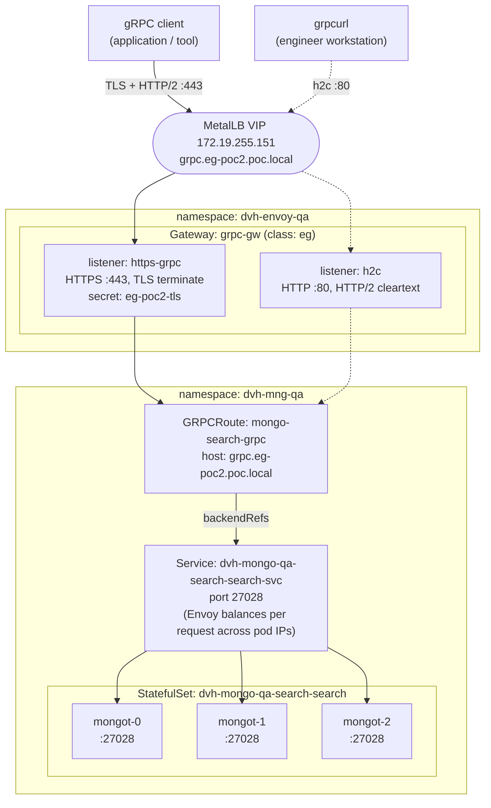
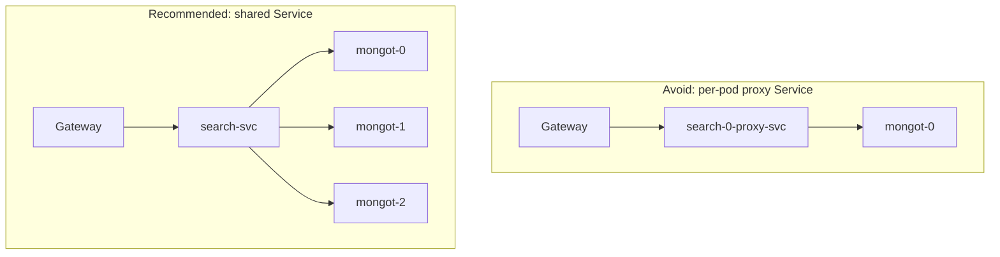
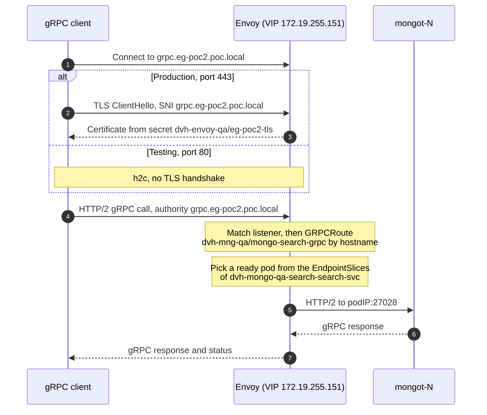
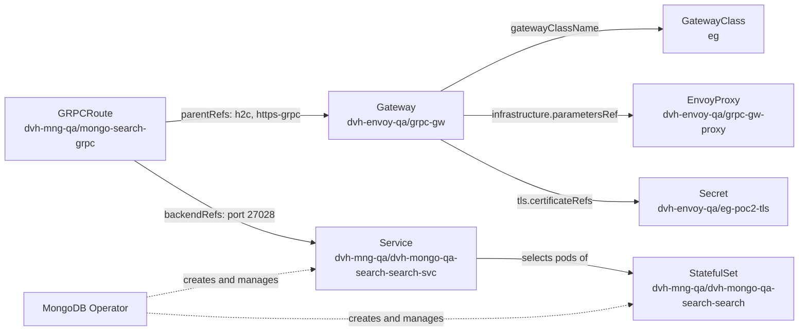

# Reference Architecture: Envoy Gateway -> GRPCRoute -> MongoDB Search (mongot)

Expose a MongoDB Search (`mongot`) StatefulSet through Envoy Gateway, using the Kubernetes Gateway API and a `GRPCRoute`. One Gateway serves two paths to the same backend:

| Path | Port | Protocol | Use |
|---|---|---|---|
| Production | 443 | TLS + HTTP/2 (gRPC) | Applications and tools |
| Testing | 80 | h2c (HTTP/2 cleartext) | Validating connectivity, routing and endpoint discovery before TLS is involved |

This README is the reference implementation. The design proposal (goals, decisions, alternatives, security, rollout plan, risks and sign-off) is in [docs/proposal.md](docs/proposal.md).

## Environment

| Item | Value |
|---|---|
| Gateway namespace | `dvh-envoy-qa` |
| Search namespace | `dvh-mng-qa` |
| GatewayClass | `eg` (Envoy Gateway) |
| Gateway | `grpc-gw` |
| EnvoyProxy | `grpc-gw-proxy` |
| Hostname | `grpc.eg-poc2.poc.local` |
| VIP (MetalLB) | `172.19.255.151` |
| TLS secret | `dvh-envoy-qa/eg-poc2-tls` |
| GRPCRoute | `dvh-mng-qa/mongo-search-grpc` |
| Backend Service | `dvh-mongo-qa-search-search-svc`, port `27028` |
| StatefulSet | `dvh-mongo-qa-search-search`, 3 replicas |
| Pods | `dvh-mongo-qa-search-search-0`, `-1`, `-2` |

### Prerequisites

- Envoy Gateway installed (GatewayClass `eg`).
- MetalLB installed, with an address pool that contains `172.19.255.151`.
- MongoDB Search deployed by the MongoDB Operator, with 3 `mongot` replicas.
- `grpc.eg-poc2.poc.local` resolves to `172.19.255.151` (DNS or `/etc/hosts`).
- `grpcurl` installed on the test workstation.

## Architecture

Solid lines are the production path (TLS, port 443). Dotted lines are the test path (h2c, port 80).



ASCII version, for terminals, wikis and anywhere Mermaid does not render:

```text
     PRODUCTION PATH (TLS)                 TEST PATH (h2c)
     +-------------------------+           +-------------------------+
     | gRPC client             |           | grpcurl                 |
     | (application / tool)    |           | (engineer workstation)  |
     +------------+------------+           +------------+------------+
                  |                                     |
                  | TLS + HTTP/2                        | h2c cleartext
                  | :443                                | :80
                  v                                     v
  +---------------------------------------------------------------------+
  | MetalLB VIP 172.19.255.151  <-  DNS: grpc.eg-poc2.poc.local         |
  | Envoy proxy Service type=LoadBalancer (EnvoyProxy: grpc-gw-proxy)   |
  | Envoy pods run in envoy-gateway-system by default                   |
  +---------------+-------------------------------------+---------------+
                  |                                     |
  +---------------+-------------------------------------+---------------+
  |               |       namespace: dvh-envoy-qa       |               |
  |               |    Gateway: grpc-gw (class: eg)     |               |
  |               v                                     v               |
  |  +-------------------------+           +-------------------------+  |
  |  | listener: https-grpc    |           | listener: h2c           |  |
  |  | HTTPS :443              |           | HTTP :80                |  |
  |  | tls: Terminate          |           | HTTP/2 cleartext        |  |
  |  | secret: eg-poc2-tls     |           |                         |  |
  |  +------------+------------+           +------------+------------+  |
  |               |                                     |               |
  +---------------+-------------------------------------+---------------+
                  |                                     |
                  |                                     |
                  +------------------+------------------+
                                     | parentRefs -> both listeners
                                     |
  +----------------------------------+----------------------------------+
  | namespace: dvh-mng-qa            v                                  |
  |            +-------------------------------------------+            |
  |            | GRPCRoute: mongo-search-grpc              |            |
  |            | hostnames: grpc.eg-poc2.poc.local         |            |
  |            | listeners: h2c, https-grpc                |            |
  |            +---------------------+---------------------+            |
  |                                  | backendRefs                      |
  |                                  v                                  |
  |            +-------------------------------------------+            |
  |            | Service: dvh-mongo-qa-search-search-svc   |            |
  |            | port: 27028                               |            |
  |            +---------------------+---------------------+            |
  |                                  | EndpointSlice: ready pod IPs     |
  |                                  | Envoy balances per request       |
  |              +-------------------+-------------------+              |
  |              |                   |                   |              |
  |              v                   v                   v              |
  |       +-------------+     +-------------+     +-------------+       |
  |       | mongot-0    |     | mongot-1    |     | mongot-2    |       |
  |       | :27028      |     | :27028      |     | :27028      |       |
  |       +-------------+     +-------------+     +-------------+       |
  | StatefulSet: dvh-mongo-qa-search-search (replicas: 3)               |
  | pods: dvh-mongo-qa-search-search-0 / -1 / -2                        |
  | Service + StatefulSet are created by the MongoDB Operator           |
  +---------------------------------------------------------------------+
```

## Why route to the shared Service

A common first attempt is to point the route at the per-pod Service `dvh-mongo-qa-search-search-0-proxy-svc`. That Service selects a single pod, so the gateway inherits a single point of failure, gets no load balancing, and cannot scale out. Point the route at `dvh-mongo-qa-search-search-svc` instead, which selects all StatefulSet replicas.



```text
AVOID: route to a per-pod proxy Service

  +---------+     +--------------------+     +----------+
  | Gateway |---->| search-0-proxy-svc |---->| mongot-0 |
  +---------+     +--------------------+     +----------+

  Single point of failure, no load balancing, no scale-out.


RECOMMENDED: route to the shared Service

                                           +----------+
                                      +--->| mongot-0 |
                                      |    +----------+
  +---------+     +------------+      |    +----------+
  | Gateway |---->| search-svc |------+--->| mongot-1 |
  +---------+     +------------+      |    +----------+
                                      |    +----------+
                                      +--->| mongot-2 |
                                           +----------+

  Load balancing, HA, automatic failover, scale-out with no gateway change.
```

(`search-0-proxy-svc` = `dvh-mongo-qa-search-search-0-proxy-svc`, `search-svc` = `dvh-mongo-qa-search-search-svc`)

Envoy Gateway does not send traffic through the Service's ClusterIP. It watches the Service's EndpointSlices and load-balances each gRPC request directly across the ready pod IPs. This matters for gRPC: HTTP/2 multiplexes many calls over one long-lived connection, so L4 balancing (kube-proxy) would pin a client to a single pod, while Envoy spreads individual requests. Replicas that are added, removed, or become unready are picked up automatically, with no gateway change.

## Request flow



```text
[1] Client resolves grpc.eg-poc2.poc.local -> 172.19.255.151
     |
     v
[2] MetalLB VIP hands the connection to an Envoy proxy pod
     |
     v
[3] Envoy listener accepts the connection
       :443  https-grpc   TLS terminated with dvh-envoy-qa/eg-poc2-tls (SNI must match)
       :80   h2c          HTTP/2 cleartext, no TLS
     |
     v
[4] Envoy matches GRPCRoute dvh-mng-qa/mongo-search-grpc
       :authority must equal grpc.eg-poc2.poc.local
       the rule has no method matches -> all gRPC services/methods
     |
     v
[5] Envoy picks a ready pod from the EndpointSlices of
    dvh-mongo-qa-search-search-svc (per-request load balancing)
     |
     v
[6] mongot-N serves the call on podIP:27028
     |
     v
[7] Response returns to the client on the same HTTP/2 stream
```

## Resource model

Arrows point from the object that holds a reference to the object it references.



## Repository layout

```text
.
|-- README.md                 Reference architecture, deploy, validate, troubleshoot
|-- .gitignore                Keeps TLS keys and certificates out of git
|-- docs/
|   `-- proposal.md           Design proposal for review and sign-off
`-- manifests/
    |-- 00-namespace.yaml     Namespace: dvh-envoy-qa (Gateway side)
    |-- 01-envoyproxy.yaml    EnvoyProxy: LoadBalancer Service + MetalLB VIP
    |-- 02-gateway.yaml       Gateway: h2c :80 and https-grpc :443 listeners
    `-- 03-grpcroute.yaml     GRPCRoute: both listeners -> mongot Service
```

## Implementation

The files below are the same ones in `manifests/`.

### 0. Namespace

The Gateway, its EnvoyProxy and the TLS secret live in `dvh-envoy-qa`. The GRPCRoute and the mongot backend stay in `dvh-mng-qa`.

```yaml
# Namespace for the Gateway, its EnvoyProxy and the TLS secret.
# The GRPCRoute and the mongot backend stay in dvh-mng-qa.
apiVersion: v1
kind: Namespace
metadata:
  name: dvh-envoy-qa
```

### 1. EnvoyProxy

Creates the Envoy data-plane Service as `type: LoadBalancer` and asks MetalLB for `172.19.255.151`. With Envoy Gateway's default deployment mode, the Envoy Deployment and this Service are created in `envoy-gateway-system`, not in `dvh-envoy-qa`.

```yaml
# EnvoyProxy: parameters for the Envoy data plane that serves Gateway dvh-envoy-qa/grpc-gw.
# Exposes Envoy as a LoadBalancer Service and pins the MetalLB VIP.
apiVersion: gateway.envoyproxy.io/v1alpha1
kind: EnvoyProxy
metadata:
  name: grpc-gw-proxy
  namespace: dvh-envoy-qa
spec:
  provider:
    type: Kubernetes
    kubernetes:
      envoyService:
        type: LoadBalancer
        # Must match the class MetalLB was started with (--lb-class).
        # If MetalLB runs without a class, remove this line.
        loadBalancerClass: metallb.io/metallb
        annotations:
          metallb.io/loadBalancerIPs: "172.19.255.151"
```

### 2. Gateway

Two listeners on the same hostname: `h2c` on port 80 for testing and `https-grpc` on port 443 for production.

```yaml
# Gateway: one VIP, two listeners.
#   h2c        :80   HTTP/2 cleartext, for testing and troubleshooting
#   https-grpc :443  TLS terminated at Envoy, for production
# The TLS secret eg-poc2-tls must exist in namespace dvh-envoy-qa (it is not kept in git).
apiVersion: gateway.networking.k8s.io/v1
kind: Gateway
metadata:
  name: grpc-gw
  namespace: dvh-envoy-qa
spec:
  gatewayClassName: eg

  infrastructure:
    parametersRef:
      group: gateway.envoyproxy.io
      kind: EnvoyProxy
      name: grpc-gw-proxy

  addresses:
    - type: IPAddress
      value: "172.19.255.151"

  listeners:
    - name: h2c
      protocol: HTTP
      port: 80
      hostname: grpc.eg-poc2.poc.local
      allowedRoutes:
        namespaces:
          from: All

    - name: https-grpc
      protocol: HTTPS
      port: 443
      hostname: grpc.eg-poc2.poc.local
      tls:
        mode: Terminate
        certificateRefs:
          - kind: Secret
            name: eg-poc2-tls
      allowedRoutes:
        namespaces:
          from: All
```

### 3. GRPCRoute

Attaches to both listeners with `sectionName`. The rule has no `matches`, so every gRPC service and method for this hostname goes to the shared Service.

```yaml
# GRPCRoute: attaches to both Gateway listeners and forwards every gRPC
# service/method for grpc.eg-poc2.poc.local to the shared mongot Service.
# Route and Service are in the same namespace, so no ReferenceGrant is needed.
apiVersion: gateway.networking.k8s.io/v1
kind: GRPCRoute
metadata:
  name: mongo-search-grpc
  namespace: dvh-mng-qa
spec:
  parentRefs:
    - name: grpc-gw
      namespace: dvh-envoy-qa
      sectionName: h2c

    - name: grpc-gw
      namespace: dvh-envoy-qa
      sectionName: https-grpc

  hostnames:
    - grpc.eg-poc2.poc.local

  rules:
    - backendRefs:
        - name: dvh-mongo-qa-search-search-svc
          port: 27028
```

### 4. TLS secret (kept out of git)

The HTTPS listener needs `eg-poc2-tls` in namespace `dvh-envoy-qa`. Never commit the private key; `.gitignore` excludes `*.key`, `*.crt` and `*.pem`.

```bash
# POC only: self-signed certificate with the right SAN
openssl req -x509 -newkey rsa:2048 -nodes -days 365 \
  -keyout tls.key -out tls.crt \
  -subj "/CN=grpc.eg-poc2.poc.local" \
  -addext "subjectAltName=DNS:grpc.eg-poc2.poc.local"

kubectl create secret tls eg-poc2-tls -n dvh-envoy-qa --cert=tls.crt --key=tls.key
```

### 5. Operator-managed resources (reference only, do not apply)

The MongoDB Operator creates and reconciles the search Service and StatefulSet. Don't hand-apply or edit them; confirm they look like this instead:

| Resource | Name | Expect |
|---|---|---|
| Service | `dvh-mongo-qa-search-search-svc` | Port `27028`, selector matches all three mongot pods |
| StatefulSet | `dvh-mongo-qa-search-search` | 3 replicas, container port `27028` |
| Pods | `dvh-mongo-qa-search-search-0/1/2` | Running and Ready |

```bash
kubectl get svc dvh-mongo-qa-search-search-svc -n dvh-mng-qa -o yaml
kubectl get statefulset dvh-mongo-qa-search-search -n dvh-mng-qa
kubectl get pods -n dvh-mng-qa --show-labels
```

### ReferenceGrant: not needed in this layout

The GRPCRoute and the Service are both in `dvh-mng-qa`, so the backend reference is same-namespace. The one cross-namespace link is the route attaching to the Gateway in `dvh-envoy-qa`, and that is governed by the listener's `allowedRoutes`, not by a ReferenceGrant. The TLS secret sits in the Gateway's own namespace, so it needs no grant either.

You only need a ReferenceGrant if the route and the Service end up in different namespaces. It lives in the Service's namespace (check the served version with `kubectl api-resources | grep -i referencegrant`):

```yaml
apiVersion: gateway.networking.k8s.io/v1beta1
kind: ReferenceGrant
metadata:
  name: allow-grpcroute-to-mongot
  namespace: dvh-mng-qa            # namespace of the Service
spec:
  from:
    - group: gateway.networking.k8s.io
      kind: GRPCRoute
      namespace: <route-namespace> # namespace of the GRPCRoute
  to:
    - group: ""
      kind: Service
      name: dvh-mongo-qa-search-search-svc
```

## Deploy

```bash
# 1. Gateway namespace
kubectl apply -f manifests/00-namespace.yaml

# 2. TLS secret (see above)
kubectl create secret tls eg-poc2-tls -n dvh-envoy-qa --cert=tls.crt --key=tls.key

# 3. Gateway resources (applied in file-name order)
kubectl apply -f manifests/
```

## Validate

```bash
# Gateway is programmed and has the VIP
kubectl get gateway grpc-gw -n dvh-envoy-qa
# NAME      CLASS   ADDRESS          PROGRAMMED   AGE
# grpc-gw   eg      172.19.255.151   True         5m

# Each listener has one attached route
kubectl get gateway grpc-gw -n dvh-envoy-qa \
  -o jsonpath='{range .status.listeners[*]}{.name}{": attachedRoutes="}{.attachedRoutes}{"\n"}{end}'
# h2c: attachedRoutes=1
# https-grpc: attachedRoutes=1

# Route accepted by both listeners and backend resolved
# (plain `kubectl get grpcroute` does not show conditions)
kubectl get grpcroute mongo-search-grpc -n dvh-mng-qa \
  -o jsonpath='{range .status.parents[*]}{.parentRef.sectionName}{": "}{range .conditions[*]}{.type}={.status}{" "}{end}{"\n"}{end}'
# h2c: Accepted=True ResolvedRefs=True
# https-grpc: Accepted=True ResolvedRefs=True

# Envoy LoadBalancer Service received the VIP from MetalLB
kubectl get svc -n envoy-gateway-system \
  -l gateway.envoyproxy.io/owning-gateway-name=grpc-gw,gateway.envoyproxy.io/owning-gateway-namespace=dvh-envoy-qa
# EXTERNAL-IP should be 172.19.255.151

# Backend has three ready endpoints on 27028
kubectl get endpointslices -n dvh-mng-qa \
  -l kubernetes.io/service-name=dvh-mongo-qa-search-search-svc

# mongot pods are running
kubectl get pods -n dvh-mng-qa -o wide | grep search-search
```

## Test

`grpcurl list` uses gRPC server reflection. See Troubleshooting if it reports that reflection is not supported.

### Port 80 (h2c)

```bash
# By hostname
grpcurl -plaintext grpc.eg-poc2.poc.local:80 list

# By IP: set :authority, otherwise it is "172.19.255.151:80",
# which does not match the listener/route hostname and Envoy finds no route
grpcurl -plaintext -authority grpc.eg-poc2.poc.local 172.19.255.151:80 list
```

### Port 443 (TLS)

```bash
# POC with a self-signed certificate (skips verification)
grpcurl -insecure grpc.eg-poc2.poc.local:443 list

# Verify the certificate (production)
grpcurl -cacert tls.crt grpc.eg-poc2.poc.local:443 list

# By IP: -authority also sets SNI, which the HTTPS listener needs
grpcurl -insecure -authority grpc.eg-poc2.poc.local 172.19.255.151:443 list
```

### Confirm load balancing across mongot pods

```bash
# Send some traffic
for i in $(seq 1 30); do
  grpcurl -plaintext grpc.eg-poc2.poc.local:80 list >/dev/null 2>&1
done

# Per-endpoint request counters from the Envoy admin API
POD=$(kubectl get pod -n envoy-gateway-system \
  -l gateway.envoyproxy.io/owning-gateway-name=grpc-gw \
  -o jsonpath='{.items[0].metadata.name}')
kubectl port-forward -n envoy-gateway-system "pod/$POD" 19000:19000 &
curl -s localhost:19000/clusters | grep '^grpcroute/dvh-mng-qa/mongo-search-grpc' | grep rq_total
# Expect three pod IPs on :27028, each with a non-zero rq_total
```

## Troubleshooting

| Symptom | Likely cause | Check |
|---|---|---|
| Envoy Service `EXTERNAL-IP` stays `<pending>` | MetalLB is not serving the Service: VIP not in a pool, VIP in use, or `loadBalancerClass` does not match MetalLB's `--lb-class` | MetalLB `IPAddressPool`, Service events, remove `loadBalancerClass` if MetalLB runs without a class |
| Gateway `PROGRAMMED=False` | Envoy Service has no address, or invalid listener config | `kubectl describe gateway grpc-gw -n dvh-envoy-qa` |
| Route `Accepted=False` | `sectionName` does not match a listener name, or route and listener hostnames do not overlap | Listener names `h2c` / `https-grpc`, `hostnames` |
| Route `ResolvedRefs=False` | Wrong Service name or port, or cross-namespace backend without a ReferenceGrant | `kubectl get svc -n dvh-mng-qa` |
| Works by hostname, fails by IP | `:authority` / SNI is the IP, not the listener hostname | Add `-authority grpc.eg-poc2.poc.local` |
| TLS handshake fails on 443 | Secret missing or in the wrong namespace, SAN does not include the hostname, SNI mismatch | Secret in `dvh-envoy-qa`, certificate SAN |
| `server does not support the reflection API` | mongot does not expose reflection, **or** Envoy found no route (a no-route reply carries the same gRPC status) | Envoy access log: an upstream host of `<podIP>:27028` means the path works; response flag `NR` means no route matched |
| `Unavailable` / `no healthy upstream` | No ready endpoints, or wrong port | EndpointSlices, pod readiness |
| Upstream connection resets or protocol errors | mongot expects TLS on 27028 | Add a `BackendTLSPolicy` so Envoy re-encrypts to the pods |

Envoy access log:

```bash
kubectl logs -n envoy-gateway-system \
  -l gateway.envoyproxy.io/owning-gateway-name=grpc-gw -c envoy --tail=20
```

## Production hardening

- **Close the test path.** After validation, remove the `h2c` listener and its `parentRef`, or move it to a separate internal-only Gateway. Port 80 is unauthenticated cleartext.
- **Use a trusted certificate.** Issue the certificate from your CA (for example with cert-manager) and test with `-cacert` rather than `-insecure`.
- **Restrict route attachment.** Replace `allowedRoutes.namespaces.from: All` with a selector so only intended namespaces can attach routes:

  ```yaml
  allowedRoutes:
    namespaces:
      from: Selector
      selector:
        matchLabels:
          kubernetes.io/metadata.name: dvh-mng-qa
  ```

- **Encrypt to the backend if required.** If mongot serves TLS, add a `BackendTLSPolicy` for `dvh-mongo-qa-search-search-svc`.
- **Remove single points of failure.** Run more than one Envoy replica (`spec.provider.kubernetes.envoyDeployment.replicas` in the EnvoyProxy) and add a PodDisruptionBudget for the mongot pods.
- **Tune traffic policy.** Review timeouts, retries and health checks with a `BackendTrafficPolicy`, especially for long-running search queries.
- **Verify multi-replica behaviour.** Confirm with the MongoDB documentation for your operator and mongot version that spreading requests across replicas behind an L7 load balancer suits your query patterns (for example, how search cursors are continued). If requests must stick to one replica, use consistent-hash load balancing in a `BackendTrafficPolicy`.
