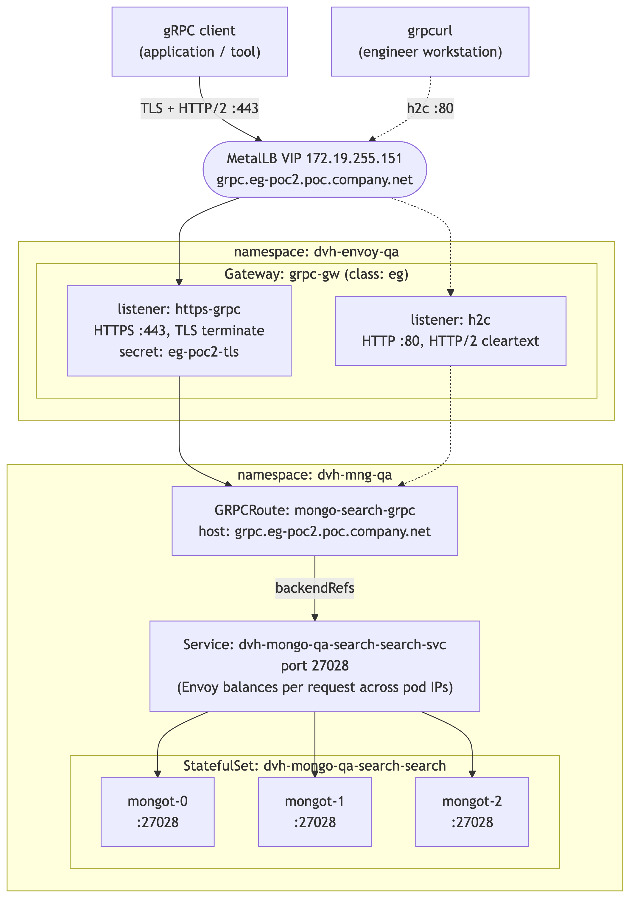
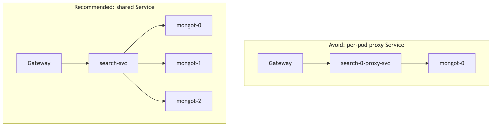
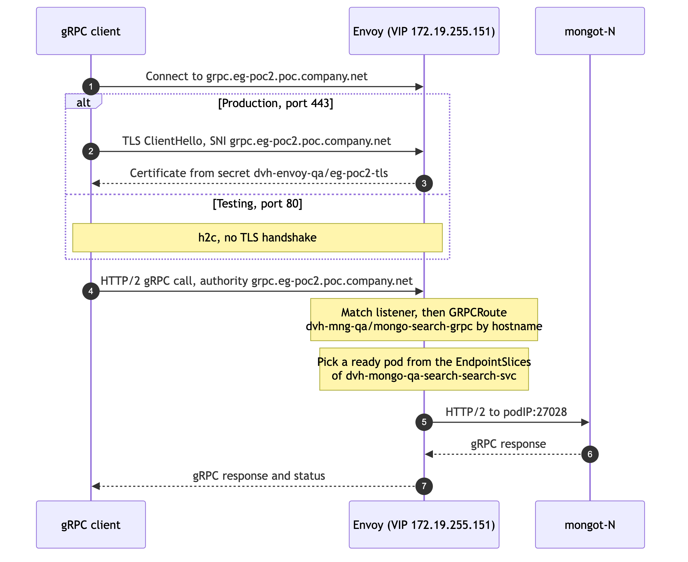
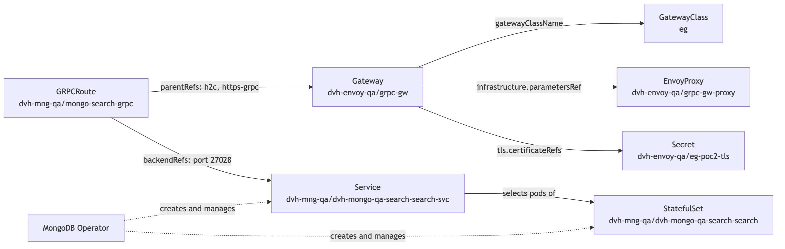
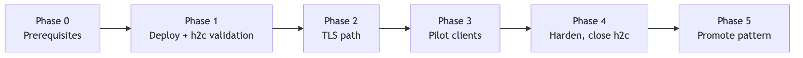

# Proposal: Expose MongoDB Search (mongot) through Envoy Gateway over gRPC

| Field | Value |
|---|---|
| Status | Proposed |
| Author | `<name>` |
| Reviewers | `<platform team>`, `<MongoDB / search owners>`, `<security>` |
| Environment | QA (`dvh-envoy-qa`, `dvh-mng-qa`) |
| Created | 2026-09-22 |
| Reference implementation | This repository. Every manifest is reproduced in full in Appendix A, so this page stands alone. |

> **Diagrams.** Each diagram is a PNG embedded by repository path, with a plain-text
> copy beside it. Confluence resolves neither, so publish `confluence.md` instead: the
> same content with a bold placeholder naming the image to attach. The Mermaid sources
> are `docs/diagrams/*.mmd`; after editing one, regenerate with `docs/diagrams/render.sh`
> and `docs/build-confluence.sh`.

## 1. Summary

We propose exposing the MongoDB Search (`mongot`) cluster in `dvh-mng-qa` through a dedicated Envoy Gateway (`grpc-gw` in `dvh-envoy-qa`), using the Kubernetes Gateway API and a `GRPCRoute`.

Clients get one stable endpoint, `grpc.eg-poc2.poc.company.net` (MetalLB VIP `172.19.255.151`), with TLS on port 443. A temporary h2c listener on port 80 supports validation and is removed before production sign-off. The gateway routes to the shared mongot Service, so Envoy load-balances each request across all three replicas, and replicas can fail or scale without any gateway change.

## 2. Background and problem

- `mongot` runs as a 3-replica StatefulSet managed by the MongoDB Operator. Its Services are reachable only inside the cluster.
- The per-pod Services the operator creates (for example `dvh-mongo-qa-search-search-0-proxy-svc`) each select a single pod. Pointing clients at one of them creates a single point of failure with no load balancing and no scale-out.
- gRPC runs over HTTP/2, which multiplexes many calls on one long-lived connection. L4 load balancing (a plain LoadBalancer Service or kube-proxy) pins each client to one pod, so load spreads poorly.
- Without a gateway there is no standard, TLS-protected entry point with a stable hostname, which makes access inconsistent and troubleshooting harder.

## 3. Goals and non-goals

**Goals**

- A single stable DNS endpoint for gRPC access to mongot.
- TLS on the production path, with certificates managed centrally at the gateway.
- Per-request load balancing across all mongot replicas, with automatic failover.
- Scale mongot replicas without touching gateway configuration.
- All configuration declarative and version-controlled (this repository).
- Clear ownership split: the platform team owns the Gateway (`dvh-envoy-qa`); the search/DB team owns the route (`dvh-mng-qa`).

**Non-goals**

- Changing mongot or MongoDB Operator configuration.
- Exposing `mongod` through this gateway.
- Client authentication and authorization at the gateway (see Open questions).
- Multi-cluster or cross-region routing.
- Production rollout beyond QA; that follows as a separate change once this proposal is accepted.

## 4. Proposed design

One Gateway serves two paths to the same backend:

| Path | Port | Protocol | Use |
|---|---|---|---|
| Production | 443 | TLS + HTTP/2 (gRPC) | Applications and tools |
| Testing | 80 | h2c (HTTP/2 cleartext) | Validating connectivity, routing and endpoint discovery before TLS is involved |

### 4.1 Environment and naming

| Item | Value |
|---|---|
| Gateway namespace | `dvh-envoy-qa` |
| Search namespace | `dvh-mng-qa` |
| GatewayClass | `eg` (Envoy Gateway) |
| Gateway | `grpc-gw` |
| EnvoyProxy | `grpc-gw-proxy` |
| Hostname | `grpc.eg-poc2.poc.company.net` |
| VIP (MetalLB) | `172.19.255.151` |
| TLS secret | `dvh-envoy-qa/eg-poc2-tls` |
| GRPCRoute | `dvh-mng-qa/mongo-search-grpc` |
| Backend Service | `dvh-mongo-qa-search-search-svc`, port `27028` |
| StatefulSet | `dvh-mongo-qa-search-search`, 3 replicas |
| Pods | `dvh-mongo-qa-search-search-0`, `-1`, `-2` |

### 4.2 Prerequisites

- Envoy Gateway installed (GatewayClass `eg`).
- MetalLB installed, with an address pool that contains `172.19.255.151`.
- MongoDB Search deployed by the MongoDB Operator, with 3 `mongot` replicas.
- `grpc.eg-poc2.poc.company.net` resolves to `172.19.255.151` (DNS or `/etc/hosts`) — see Appendix A.5.
- An internal CA, or cert-manager on the cluster, to issue the gateway certificate — see Appendix A.6.
- `grpcurl` installed on the test workstation.

### 4.3 Architecture

Solid lines are the production path (TLS, port 443). Dotted lines are the test path (h2c, port 80).



```text
     PRODUCTION PATH (TLS)                 TEST PATH (h2c)
     +-------------------------+           +-------------------------+
     | gRPC client             |           | grpcurl                 |
     | (application / tool)    |           | (engineer workstation)  |
     +------------+------------+           +------------+------------+
                  |                                     |
                  | TLS + HTTP/2                        | h2c cleartext
                  | :443                                | :80
                  v                                     v
  +---------------------------------------------------------------------+
  | MetalLB VIP 172.19.255.151  <-  DNS: grpc.eg-poc2.poc.company.net   |
  | Envoy proxy Service type=LoadBalancer (EnvoyProxy: grpc-gw-proxy)   |
  | Envoy pods run in envoy-gateway-system by default                   |
  +---------------+-------------------------------------+---------------+
                  |                                     |
  +---------------+-------------------------------------+---------------+
  |               |       namespace: dvh-envoy-qa       |               |
  |               |    Gateway: grpc-gw (class: eg)     |               |
  |               v                                     v               |
  |  +-------------------------+           +-------------------------+  |
  |  | listener: https-grpc    |           | listener: h2c           |  |
  |  | HTTPS :443              |           | HTTP :80                |  |
  |  | tls: Terminate          |           | HTTP/2 cleartext        |  |
  |  | secret: eg-poc2-tls     |           |                         |  |
  |  +------------+------------+           +------------+------------+  |
  |               |                                     |               |
  +---------------+-------------------------------------+---------------+
                  |                                     |
                  +------------------+------------------+
                                     | parentRefs -> both listeners
                                     |
  +----------------------------------+----------------------------------+
  | namespace: dvh-mng-qa            v                                  |
  |            +-------------------------------------------+            |
  |            | GRPCRoute: mongo-search-grpc              |            |
  |            | hostnames: grpc.eg-poc2.poc.company.net   |            |
  |            | listeners: h2c, https-grpc                |            |
  |            +---------------------+---------------------+            |
  |                                  | backendRefs                      |
  |                                  v                                  |
  |            +-------------------------------------------+            |
  |            | Service: dvh-mongo-qa-search-search-svc   |            |
  |            | port: 27028                               |            |
  |            +---------------------+---------------------+            |
  |                                  | EndpointSlice: ready pod IPs     |
  |                                  | Envoy balances per request       |
  |              +-------------------+-------------------+              |
  |              |                   |                   |              |
  |              v                   v                   v              |
  |       +-------------+     +-------------+     +-------------+       |
  |       | mongot-0    |     | mongot-1    |     | mongot-2    |       |
  |       | :27028      |     | :27028      |     | :27028      |       |
  |       +-------------+     +-------------+     +-------------+       |
  | StatefulSet: dvh-mongo-qa-search-search (replicas: 3)               |
  | pods: dvh-mongo-qa-search-search-0 / -1 / -2                        |
  | Service + StatefulSet are created by the MongoDB Operator           |
  +---------------------------------------------------------------------+
```


### 4.4 Why the route targets the shared Service

A common first attempt is to point the route at the per-pod Service `dvh-mongo-qa-search-search-0-proxy-svc`. That Service selects a single pod, so the gateway inherits a single point of failure, gets no load balancing, and cannot scale out. The route targets `dvh-mongo-qa-search-search-svc` instead, which selects all StatefulSet replicas.



```text
AVOID: route to a per-pod proxy Service

  +---------+     +--------------------+     +----------+
  | Gateway |---->| search-0-proxy-svc |---->| mongot-0 |
  +---------+     +--------------------+     +----------+

  Single point of failure, no load balancing, no scale-out.


RECOMMENDED: route to the shared Service

                                           +----------+
                                      +--->| mongot-0 |
                                      |    +----------+
  +---------+     +------------+      |    +----------+
  | Gateway |---->| search-svc |------+--->| mongot-1 |
  +---------+     +------------+      |    +----------+
                                      |    +----------+
                                      +--->| mongot-2 |
                                           +----------+

  Load balancing, HA, automatic failover, scale-out with no gateway change.
```


(`search-0-proxy-svc` = `dvh-mongo-qa-search-search-0-proxy-svc`, `search-svc` = `dvh-mongo-qa-search-search-svc`)

Envoy Gateway does not send traffic through the Service's ClusterIP. It watches the Service's EndpointSlices and load-balances each gRPC request directly across the ready pod IPs. This matters for gRPC: HTTP/2 multiplexes many calls over one long-lived connection, so L4 balancing (kube-proxy) would pin a client to a single pod, while Envoy spreads individual requests. Replicas that are added, removed, or become unready are picked up automatically, with no gateway change.

### 4.5 Request flow



```text
[1] Client resolves grpc.eg-poc2.poc.company.net -> 172.19.255.151
     |
     v
[2] MetalLB VIP hands the connection to an Envoy proxy pod
     |
     v
[3] Envoy listener accepts the connection
       :443  https-grpc   TLS terminated with dvh-envoy-qa/eg-poc2-tls (SNI must match)
       :80   h2c          HTTP/2 cleartext, no TLS
     |
     v
[4] Envoy matches GRPCRoute dvh-mng-qa/mongo-search-grpc
       :authority must equal grpc.eg-poc2.poc.company.net
       the rule has no method matches -> all gRPC services/methods
     |
     v
[5] Envoy picks a ready pod from the EndpointSlices of
    dvh-mongo-qa-search-search-svc (per-request load balancing)
     |
     v
[6] mongot-N serves the call on podIP:27028
     |
     v
[7] Response returns to the client on the same HTTP/2 stream
```


### 4.6 Resource model

Arrows point from the object that holds a reference to the object it references.



```text
  GatewayClass: eg <----------------+ gatewayClassName
                                    |
  EnvoyProxy: dvh-envoy-qa/  <------+ infrastructure.parametersRef
    grpc-gw-proxy                   |
                                    |
  Secret: dvh-envoy-qa/      <------+ tls.certificateRefs
    eg-poc2-tls                     |
                                    |
                          Gateway: dvh-envoy-qa/grpc-gw
                                    ^
                                    | parentRefs (sectionName: h2c, https-grpc)
                                    |
                          GRPCRoute: dvh-mng-qa/mongo-search-grpc
                                    |
                                    | backendRefs (port 27028)
                                    v
                          Service: dvh-mng-qa/dvh-mongo-qa-search-search-svc
                                    |
                                    | selects pods of
                                    v
                          StatefulSet: dvh-mng-qa/dvh-mongo-qa-search-search

  MongoDB Operator creates and manages the Service and the StatefulSet.
```


### 4.7 Components and ownership

| Component | Name | Namespace | Owner |
|---|---|---|---|
| EnvoyProxy | `grpc-gw-proxy` | `dvh-envoy-qa` | Platform |
| Gateway | `grpc-gw` | `dvh-envoy-qa` | Platform |
| TLS secret | `eg-poc2-tls` | `dvh-envoy-qa` | Platform / Security |
| GRPCRoute | `mongo-search-grpc` | `dvh-mng-qa` | Search / DB team |
| Service and StatefulSet | `dvh-mongo-qa-search-search(-svc)` | `dvh-mng-qa` | MongoDB Operator |
| Envoy data plane (Deployment + LoadBalancer Service) | managed | `envoy-gateway-system` | Envoy Gateway |

## 5. Key design decisions

| # | Decision | Choice | Rationale |
|---|---|---|---|
| D1 | Backend target | Shared Service `dvh-mongo-qa-search-search-svc` | Selects all replicas: load balancing, failover and scale-out with no gateway change. Per-pod Services are a single point of failure. |
| D2 | Load-balancing layer | Envoy (L7, per request) | Envoy reads EndpointSlices and balances individual gRPC calls. L4 balancing pins long-lived HTTP/2 connections to one pod. |
| D3 | TLS handling | Terminate at the gateway | Enables hostname and gRPC method routing and central certificate management. Trade-off: the gateway-to-mongot hop is cleartext inside the cluster unless a `BackendTLSPolicy` is added. |
| D4 | Test path | h2c listener on port 80, temporary | Validates routing and endpoints without TLS in the way. Removed, or moved to an internal-only Gateway, before production. |
| D5 | Namespace layout | Gateway in `dvh-envoy-qa`, route in `dvh-mng-qa` | Follows the Gateway API role model. Route and Service share a namespace, so no ReferenceGrant is needed. |
| D6 | Dedicated Gateway and VIP | Separate `grpc-gw` rather than sharing an HTTP gateway | Limits blast radius and lets gRPC settings (timeouts, TLS, policies) evolve independently. |

## 6. Alternatives considered

| Alternative | Why not chosen |
|---|---|
| Route to a per-pod proxy Service | Single point of failure, no load balancing, no scale-out. |
| Expose the mongot Service directly as `type: LoadBalancer` | L4 only: no TLS termination, no hostname routing, and HTTP/2 connections pin clients to one pod. |
| TLS passthrough with `TLSRoute` | Keeps TLS end to end, but Envoy cannot see individual gRPC calls, so balancing is per connection. `TLSRoute` is also in the Gateway API experimental channel. |
| Ingress controller with gRPC annotations | Vendor-specific annotations, weaker role separation and less expressive than Gateway API. |
| NodePort | No stable VIP, no TLS, exposes node ports. |

## 7. Security considerations

- **Certificates.** Issue the gateway certificate from the internal CA and verify it from clients. The VIP is RFC 1918 and the QA zone is served internally, so the trust anchor is ours to distribute rather than a public CA's. Appendix A.6 gives both paths: manual `openssl` plus `kubectl create secret tls`, or cert-manager with a CA `ClusterIssuer`. Private keys never go into git; `.gitignore` excludes `*.key`, `*.crt` and `*.pem`.
- **Cleartext test path.** The h2c listener on port 80 is unauthenticated cleartext. It exists for QA validation only and is closed before production sign-off (see §9, Phase 4).
- **Route attachment.** `allowedRoutes.namespaces.from: All` is restricted to a namespace selector during hardening, so only `dvh-mng-qa` can attach routes.
- **Backend encryption.** If policy requires encryption inside the cluster, add a `BackendTLSPolicy` so Envoy re-encrypts to mongot.
- **Network policy.** Allow ingress to mongot on 27028 only from the Envoy pods and existing `mongod` traffic.
- **Client authentication.** Not in scope for this phase. Envoy Gateway can add client-certificate (mTLS) validation later through a `ClientTrafficPolicy`.

## 8. Operations

### 8.1 Deploy

```bash
# 1. Gateway namespace
kubectl apply -f manifests/00-namespace.yaml

# 2. TLS certificate (see Appendix A.6)
kubectl create secret tls eg-poc2-tls -n dvh-envoy-qa --cert=tls.crt --key=tls.key

# 3. Gateway resources (applied in file-name order)
kubectl apply -f manifests/
```

### 8.2 Validate

```bash
# Gateway is programmed and has the VIP
kubectl get gateway grpc-gw -n dvh-envoy-qa
# NAME      CLASS   ADDRESS          PROGRAMMED   AGE
# grpc-gw   eg      172.19.255.151   True         5m

# Each listener has one attached route
kubectl get gateway grpc-gw -n dvh-envoy-qa \
  -o jsonpath='{range .status.listeners[*]}{.name}{": attachedRoutes="}{.attachedRoutes}{"\n"}{end}'
# h2c: attachedRoutes=1
# https-grpc: attachedRoutes=1

# Route accepted by both listeners and backend resolved
# (plain `kubectl get grpcroute` does not show conditions)
kubectl get grpcroute mongo-search-grpc -n dvh-mng-qa \
  -o jsonpath='{range .status.parents[*]}{.parentRef.sectionName}{": "}{range .conditions[*]}{.type}={.status}{" "}{end}{"\n"}{end}'
# h2c: Accepted=True ResolvedRefs=True
# https-grpc: Accepted=True ResolvedRefs=True

# Envoy LoadBalancer Service received the VIP from MetalLB
kubectl get svc -n envoy-gateway-system \
  -l gateway.envoyproxy.io/owning-gateway-name=grpc-gw,gateway.envoyproxy.io/owning-gateway-namespace=dvh-envoy-qa
# EXTERNAL-IP should be 172.19.255.151

# Backend has three ready endpoints on 27028
kubectl get endpointslices -n dvh-mng-qa \
  -l kubernetes.io/service-name=dvh-mongo-qa-search-search-svc

# mongot pods are running
kubectl get pods -n dvh-mng-qa -o wide | grep search-search
```

### 8.3 Test

`grpcurl list` uses gRPC server reflection. See §8.4 if it reports that reflection is not supported.

**Port 80 (h2c)**

```bash
# By hostname
grpcurl -plaintext grpc.eg-poc2.poc.company.net:80 list

# By IP: set :authority, otherwise it is "172.19.255.151:80",
# which does not match the listener/route hostname and Envoy finds no route
grpcurl -plaintext -authority grpc.eg-poc2.poc.company.net 172.19.255.151:80 list
```

**Port 443 (TLS)**

```bash
# POC with a self-signed certificate (skips verification)
grpcurl -insecure grpc.eg-poc2.poc.company.net:443 list

# Verify the certificate (production)
grpcurl -cacert tls.crt grpc.eg-poc2.poc.company.net:443 list

# By IP: -authority also sets SNI, which the HTTPS listener needs
grpcurl -insecure -authority grpc.eg-poc2.poc.company.net 172.19.255.151:443 list
```

**Confirm load balancing across mongot pods**

```bash
# Send some traffic
for i in $(seq 1 30); do
  grpcurl -plaintext grpc.eg-poc2.poc.company.net:80 list >/dev/null 2>&1
done

# Per-endpoint request counters from the Envoy admin API
POD=$(kubectl get pod -n envoy-gateway-system \
  -l gateway.envoyproxy.io/owning-gateway-name=grpc-gw \
  -o jsonpath='{.items[0].metadata.name}')
kubectl port-forward -n envoy-gateway-system "pod/$POD" 19000:19000 &
curl -s localhost:19000/clusters | grep '^grpcroute/dvh-mng-qa/mongo-search-grpc' | grep rq_total
# Expect three pod IPs on :27028, each with a non-zero rq_total
```

### 8.4 Troubleshooting

| Symptom | Likely cause | Check |
|---|---|---|
| Envoy Service `EXTERNAL-IP` stays `<pending>` | MetalLB is not serving the Service: VIP not in a pool, VIP in use, or `loadBalancerClass` does not match MetalLB's `--lb-class` | MetalLB `IPAddressPool`, Service events, remove `loadBalancerClass` if MetalLB runs without a class |
| Gateway `PROGRAMMED=False` | Envoy Service has no address, or invalid listener config | `kubectl describe gateway grpc-gw -n dvh-envoy-qa` |
| Route `Accepted=False` | `sectionName` does not match a listener name, or route and listener hostnames do not overlap | Listener names `h2c` / `https-grpc`, `hostnames` |
| Route `ResolvedRefs=False` | Wrong Service name or port, or cross-namespace backend without a ReferenceGrant | `kubectl get svc -n dvh-mng-qa` |
| Works by hostname, fails by IP | `:authority` / SNI is the IP, not the listener hostname | Add `-authority grpc.eg-poc2.poc.company.net` |
| TLS handshake fails on 443 | Secret missing or in the wrong namespace, SAN does not include the hostname, SNI mismatch | Secret in `dvh-envoy-qa`, certificate SAN |
| Hostname does not resolve | No A record in the resolver the client actually uses, or the client is answered by the public view of `poc.company.net` rather than the internal one | `dig +short grpc.eg-poc2.poc.company.net` must return the VIP |
| cert-manager `Certificate` stays `READY=False` | Issuer missing or not ready, or the CA Secret is not in the namespace cert-manager reads ClusterIssuer secrets from | `kubectl describe certificate eg-poc2-tls -n dvh-envoy-qa`, then `kubectl describe clusterissuer poc-company-net-ca` |
| `server does not support the reflection API` | mongot does not expose reflection, **or** Envoy found no route (a no-route reply carries the same gRPC status) | Envoy access log: an upstream host of `<podIP>:27028` means the path works; response flag `NR` means no route matched |
| `Unavailable` / `no healthy upstream` | No ready endpoints, or wrong port | EndpointSlices, pod readiness |
| Upstream connection resets or protocol errors | mongot expects TLS on 27028 | Add a `BackendTLSPolicy` so Envoy re-encrypts to the pods |

Envoy access log:

```bash
kubectl logs -n envoy-gateway-system \
  -l gateway.envoyproxy.io/owning-gateway-name=grpc-gw -c envoy --tail=20
```

### 8.5 Day-2 operations

- **Health and status.** Gateway `PROGRAMMED`, route `Accepted` / `ResolvedRefs`, and EndpointSlice readiness, using the commands in §8.2.
- **Observability.** Envoy access logs (response flags, upstream host) and Envoy metrics for request rate, errors and latency per mongot endpoint.
- **Scaling.** mongot replicas change through the MongoDB Operator; Envoy picks up new endpoints automatically.
- **Certificate rotation.** Envoy Gateway reloads the Secret without a restart either way. With cert-manager (Appendix A.6, Option B) renewal is automatic at `renewBefore`; without it, renewal is a diarised manual task and an expired certificate is the likelier outage.
- **Operator upgrades.** After each operator upgrade, confirm the Service name, port and selector are unchanged; a change shows up as `ResolvedRefs=False` on the route.

## 9. Rollout plan



```text
  Phase 0        Phase 1              Phase 2      Phase 3    Phase 4          Phase 5
  Prerequisites -> Deploy + h2c ------> TLS path -> Pilot ---> Harden, ------> Promote
                   validation                       clients    close h2c       pattern
```


| Phase | Scope | Exit criteria |
|---|---|---|
| 0. Prerequisites | A record for `grpc.eg-poc2.poc.company.net` in the internal resolver; VIP `172.19.255.151` in a MetalLB pool; `dvh-envoy-qa` namespace; certificate issued into `dvh-envoy-qa/eg-poc2-tls` (Appendix A.5, A.6) | `dig +short` returns the VIP, VIP free, Secret present with the hostname in its SAN |
| 1. Deploy and validate (h2c) | Apply `manifests/`; test on port 80 | Gateway programmed, route accepted on both listeners, 3 ready endpoints, `grpcurl` succeeds on :80 |
| 2. TLS path | Test on port 443 with certificate verification | `grpcurl -cacert` succeeds on :443 |
| 3. Pilot | Point one or two agreed clients at the endpoint for an agreed soak period | No client-visible errors; requests spread across all 3 pods |
| 4. Harden | Remove h2c listener; restrict `allowedRoutes`; 2+ Envoy replicas; PDB; NetworkPolicy; timeouts via `BackendTrafficPolicy` | Security review sign-off |
| 5. Promote | Reuse the pattern for other environments | Separate change per environment |

**Rollback.** The gateway resources are additive and do not modify mongot, so rollback is `kubectl delete -f manifests/` and pointing clients back at their previous access path. The backend is unaffected.

## 10. Acceptance criteria

- [ ] Gateway `grpc-gw` is `PROGRAMMED=True` with address `172.19.255.151`.
- [ ] GRPCRoute is `Accepted=True` and `ResolvedRefs=True` on both listeners.
- [ ] Service `dvh-mongo-qa-search-search-svc` has 3 ready endpoints on 27028.
- [ ] `grpcurl` succeeds through port 80 (h2c) and port 443 (TLS, verified certificate).
- [ ] Envoy stats show requests on all three mongot endpoints.
- [ ] Deleting one mongot pod causes no client-visible failures beyond in-flight requests.
- [ ] h2c listener removed before production sign-off.

## 11. Risks and mitigations

| Risk | Impact | Mitigation |
|---|---|---|
| mongot behaviour when calls for one query land on different replicas (for example how search cursors are continued) | Failed or inconsistent queries | Confirm with MongoDB documentation for our operator and mongot version during Phase 1; if needed, use consistent-hash load balancing in a `BackendTrafficPolicy` |
| MetalLB `loadBalancerClass` mismatch or VIP conflict | No external address | Check the MetalLB class and pool in Phase 0 |
| Cleartext test path left open | Unencrypted access to search | Phase 4 gate; acceptance criterion |
| Single Envoy replica | Gateway outage | 2+ replicas in the EnvoyProxy, spread across nodes |
| Long-running queries hit default timeouts | Failed queries | Tune timeouts in a `BackendTrafficPolicy` |
| Operator upgrade renames or relabels the Service | Route loses its backend | Post-upgrade check; alert on route `ResolvedRefs=False` |

## 12. Open questions

1. Which clients will use this endpoint (`mongod`, applications, tooling)?
2. Does security policy require TLS on the gateway-to-mongot hop?
3. Is client authentication (mTLS or other) required at the gateway?
4. What are the production hostname and certificate issuer?
5. Does our mongot version support per-request load balancing across replicas for our query patterns?
6. Which team owns the `dvh-envoy-qa` Gateway day to day?

## 13. Decision and approvals

| Role | Name | Decision | Date |
|---|---|---|---|
| Platform |  |  |  |
| MongoDB / Search |  |  |  |
| Security |  |  |  |

## Appendix A: Manifests and cluster prerequisites

A.1 to A.4 are the files in `manifests/`, reproduced in full so this page is self-contained. A.5 and A.6 cover the two things the manifests cannot create for themselves: the DNS record and the TLS certificate.

### A.1 `00-namespace.yaml`

The Gateway, its EnvoyProxy and the TLS secret live in `dvh-envoy-qa`. The GRPCRoute and the mongot backend stay in `dvh-mng-qa`.

```yaml
# Namespace for the Gateway, its EnvoyProxy and the TLS secret.
# The GRPCRoute and the mongot backend stay in dvh-mng-qa.
apiVersion: v1
kind: Namespace
metadata:
  name: dvh-envoy-qa
```

### A.2 `01-envoyproxy.yaml`

Creates the Envoy data-plane Service as `type: LoadBalancer` and asks MetalLB for `172.19.255.151`. With Envoy Gateway's default deployment mode, the Envoy Deployment and this Service are created in `envoy-gateway-system`, not in `dvh-envoy-qa`.

```yaml
# EnvoyProxy: parameters for the Envoy data plane that serves Gateway dvh-envoy-qa/grpc-gw.
# Exposes Envoy as a LoadBalancer Service and pins the MetalLB VIP.
apiVersion: gateway.envoyproxy.io/v1alpha1
kind: EnvoyProxy
metadata:
  name: grpc-gw-proxy
  namespace: dvh-envoy-qa
spec:
  provider:
    type: Kubernetes
    kubernetes:
      envoyService:
        type: LoadBalancer
        # Must match the class MetalLB was started with (--lb-class).
        # If MetalLB runs without a class, remove this line.
        loadBalancerClass: metallb.io/metallb
        annotations:
          metallb.io/loadBalancerIPs: "172.19.255.151"
```

### A.3 `02-gateway.yaml`

Two listeners on the same hostname: `h2c` on port 80 for testing and `https-grpc` on port 443 for production.

```yaml
# Gateway: one VIP, two listeners.
#   h2c        :80   HTTP/2 cleartext, for testing and troubleshooting
#   https-grpc :443  TLS terminated at Envoy, for production
# The TLS secret eg-poc2-tls must exist in namespace dvh-envoy-qa (it is not kept in git).
apiVersion: gateway.networking.k8s.io/v1
kind: Gateway
metadata:
  name: grpc-gw
  namespace: dvh-envoy-qa
spec:
  gatewayClassName: eg

  infrastructure:
    parametersRef:
      group: gateway.envoyproxy.io
      kind: EnvoyProxy
      name: grpc-gw-proxy

  addresses:
    - type: IPAddress
      value: "172.19.255.151"

  listeners:
    - name: h2c
      protocol: HTTP
      port: 80
      hostname: grpc.eg-poc2.poc.company.net
      allowedRoutes:
        namespaces:
          from: All

    - name: https-grpc
      protocol: HTTPS
      port: 443
      hostname: grpc.eg-poc2.poc.company.net
      tls:
        mode: Terminate
        certificateRefs:
          - kind: Secret
            name: eg-poc2-tls
      allowedRoutes:
        namespaces:
          from: All
```

### A.4 `03-grpcroute.yaml`

Attaches to both listeners with `sectionName`. The rule has no `matches`, so every gRPC service and method for this hostname goes to the shared Service.

```yaml
# GRPCRoute: attaches to both Gateway listeners and forwards every gRPC
# service/method for grpc.eg-poc2.poc.company.net to the shared mongot Service.
# Route and Service are in the same namespace, so no ReferenceGrant is needed.
apiVersion: gateway.networking.k8s.io/v1
kind: GRPCRoute
metadata:
  name: mongo-search-grpc
  namespace: dvh-mng-qa
spec:
  parentRefs:
    - name: grpc-gw
      namespace: dvh-envoy-qa
      sectionName: h2c

    - name: grpc-gw
      namespace: dvh-envoy-qa
      sectionName: https-grpc

  hostnames:
    - grpc.eg-poc2.poc.company.net

  rules:
    - backendRefs:
        - name: dvh-mongo-qa-search-search-svc
          port: 27028
```

### A.5 DNS record

The Gateway pins `172.19.255.151` (the MetalLB annotation on the EnvoyProxy plus `addresses` on the Gateway), so the address is deterministic. Read it back after applying anyway — MetalLB only honours the request if the VIP is free and inside one of its pools.

```bash
# What MetalLB actually assigned, via the Gateway status
kubectl get gateway grpc-gw -n dvh-envoy-qa \
  -o jsonpath='{.status.addresses[*].value}{"\n"}'

# The same value from the Envoy LoadBalancer Service
kubectl get svc -n envoy-gateway-system \
  -l gateway.envoyproxy.io/owning-gateway-name=grpc-gw,gateway.envoyproxy.io/owning-gateway-namespace=dvh-envoy-qa \
  -o jsonpath='{.items[0].status.loadBalancer.ingress[0].ip}{"\n"}'
```

Create an A record pointing the hostname at that address:

| Record | Type | Value | TTL |
|---|---|---|---|
| `grpc.eg-poc2.poc.company.net` | A | `172.19.255.151` | 300 |

`172.19.255.151` is RFC 1918 address space, so this record belongs in the internal (split-horizon) view that serves `poc.company.net`. Publishing a private address in a public zone leaks internal addressing and helps nobody outside the network, who still cannot route to it.

If you expect more gateway hostnames under the same zone later, a wildcard A record `*.eg-poc2.poc.company.net` pointing at the same VIP saves a DNS change per hostname. Pair it with the wildcard certificate below.

**Workstation only, no DNS change** — enough to run the tests in this document:

```bash
echo "172.19.255.151  grpc.eg-poc2.poc.company.net" | sudo tee -a /etc/hosts
```

**In-cluster clients** resolve through CoreDNS, which does not know this name. If pods must reach the gateway by hostname, add a `hosts` block to the CoreDNS ConfigMap (`kubectl -n kube-system edit configmap coredns`):

```text
hosts {
    172.19.255.151 grpc.eg-poc2.poc.company.net
    fallthrough
}
```

Verify before touching TLS — both commands must return the VIP:

```bash
dig +short grpc.eg-poc2.poc.company.net
getent hosts grpc.eg-poc2.poc.company.net
```

This matters more than it looks: the hostname is matched three times over — by the listener, by the GRPCRoute `hostnames`, and by the certificate SAN. If DNS is wrong, failures surface as "no route" or a TLS handshake error rather than as a name-resolution error.

### A.6 TLS certificate

The `https-grpc` listener consumes exactly one Secret:

```yaml
tls:
  mode: Terminate
  certificateRefs:
    - kind: Secret
      name: eg-poc2-tls
```

`certificateRefs` carries no `namespace`, so it resolves in the Gateway's own namespace, `dvh-envoy-qa`. The Secret must exist there — a Secret in another namespace needs a ReferenceGrant.

Three constraints apply to either path below:

- **The SAN must contain the hostname.** Modern TLS clients, including gRPC ones, ignore `CN`. A certificate with `CN=grpc.eg-poc2.poc.company.net` and no `subjectAltName` fails verification.
- **A public CA can issue only if the zone is publicly delegated.** `poc.company.net` is a real, delegable name, so unlike a reserved suffix this is possible in principle. In practice the VIP is RFC 1918 and unreachable from the internet, which rules out HTTP-01 and leaves DNS-01 against the public zone. Where `poc.company.net` is served only by internal DNS, an internal CA is the workable path, and that is what Option B assumes.
- **A wildcard matches exactly one label.** `*.eg-poc2.poc.company.net` covers `grpc.eg-poc2.poc.company.net`, but not `a.b.eg-poc2.poc.company.net` and not the bare `eg-poc2.poc.company.net`. List the apex explicitly if you need it.

#### Option A: without cert-manager

**Single host (self-signed, POC):**

```bash
openssl req -x509 -newkey rsa:2048 -nodes -days 365 \
  -keyout tls.key -out tls.crt \
  -subj "/CN=grpc.eg-poc2.poc.company.net" \
  -addext "subjectAltName=DNS:grpc.eg-poc2.poc.company.net"
```

**Wildcard (self-signed), covering every host in the zone:**

```bash
openssl req -x509 -newkey rsa:2048 -nodes -days 365 \
  -keyout tls.key -out tls.crt \
  -subj "/CN=*.eg-poc2.poc.company.net" \
  -addext "subjectAltName=DNS:*.eg-poc2.poc.company.net,DNS:eg-poc2.poc.company.net"
```

**Signed by your internal CA** — generate a CSR, have the CA sign it, then assemble the chain:

```bash
openssl req -new -newkey rsa:2048 -nodes \
  -keyout tls.key -out tls.csr \
  -subj "/CN=grpc.eg-poc2.poc.company.net" \
  -addext "subjectAltName=DNS:grpc.eg-poc2.poc.company.net"

# Submit tls.csr to the CA. Save the signed leaf, then any intermediates,
# into tls.crt in that order. Do not append the root.
```

**Create the Secret** (identical for all three):

```bash
kubectl create secret tls eg-poc2-tls -n dvh-envoy-qa --cert=tls.crt --key=tls.key
```

**Rotation is yours to run.** Replace the Secret before expiry; Envoy Gateway watches it and pushes the new certificate without a restart:

```bash
kubectl create secret tls eg-poc2-tls -n dvh-envoy-qa \
  --cert=tls.crt --key=tls.key --dry-run=client -o yaml | kubectl apply -f -
```

**Confirm what landed in the cluster:**

```bash
kubectl get secret eg-poc2-tls -n dvh-envoy-qa
kubectl get secret eg-poc2-tls -n dvh-envoy-qa -o jsonpath='{.data.tls\.crt}' \
  | base64 -d | openssl x509 -noout -subject -ext subjectAltName -dates
```

Never commit the key. `.gitignore` excludes `*.key`, `*.crt` and `*.pem`.

#### Option B: with cert-manager

Check whether it is already on the cluster:

```bash
kubectl get crd certificates.cert-manager.io >/dev/null 2>&1 && echo present || echo absent
kubectl get pods -n cert-manager
```

This example signs from an internal root, the right default for a QA hostname that resolves only inside the network. If `poc.company.net` is publicly delegated and you would rather use ACME, swap this `ClusterIssuer` for an ACME one with a DNS-01 solver and leave the `Certificate` below unchanged. Bootstrap the internal root if you do not already have a CA to import:

```yaml
# A self-signed issuer whose only job is to mint the root below.
apiVersion: cert-manager.io/v1
kind: ClusterIssuer
metadata:
  name: selfsigned-root
spec:
  selfSigned: {}
---
# The internal root CA. Its public half is the trust anchor you hand to clients.
# The Secret must live in the namespace cert-manager reads ClusterIssuer secrets
# from, which is cert-manager's own namespace by default.
apiVersion: cert-manager.io/v1
kind: Certificate
metadata:
  name: poc-company-net-ca
  namespace: cert-manager
spec:
  isCA: true
  commonName: poc.company.net internal CA
  secretName: poc-company-net-ca
  duration: 43800h          # 5 years
  privateKey:
    algorithm: ECDSA
    size: 256
  issuerRef:
    name: selfsigned-root
    kind: ClusterIssuer
    group: cert-manager.io
---
# The issuer that signs leaf certificates with that root.
apiVersion: cert-manager.io/v1
kind: ClusterIssuer
metadata:
  name: poc-company-net-ca
spec:
  ca:
    secretName: poc-company-net-ca
```

**Leaf certificate, single host.** `secretName` must equal the `certificateRefs` name on the listener:

```yaml
apiVersion: cert-manager.io/v1
kind: Certificate
metadata:
  name: eg-poc2-tls
  namespace: dvh-envoy-qa
spec:
  secretName: eg-poc2-tls   # consumed by listener https-grpc
  duration: 2160h           # 90 days
  renewBefore: 360h         # renew 15 days out
  commonName: grpc.eg-poc2.poc.company.net
  dnsNames:
    - grpc.eg-poc2.poc.company.net
  usages:
    - server auth
  privateKey:
    algorithm: ECDSA
    size: 256
    rotationPolicy: Always
  issuerRef:
    name: poc-company-net-ca
    kind: ClusterIssuer
    group: cert-manager.io
```

**Wildcard variant** — same resource, different names:

```yaml
  commonName: "*.eg-poc2.poc.company.net"
  dnsNames:
    - "*.eg-poc2.poc.company.net"
    - eg-poc2.poc.company.net
```

A wildcard from a public ACME issuer would additionally need a DNS-01 solver, because HTTP-01 cannot validate wildcards. That does not apply to a CA issuer, which signs whatever names you ask for.

**Verify issuance:**

```bash
kubectl get certificate eg-poc2-tls -n dvh-envoy-qa
# READY must be True
kubectl describe certificate eg-poc2-tls -n dvh-envoy-qa
```

**Client trust** — export the root and verify against it instead of using `-insecure`:

```bash
kubectl get secret poc-company-net-ca -n cert-manager -o jsonpath='{.data.tls\.crt}' \
  | base64 -d > poc-company-net-ca.crt
grpcurl -cacert poc-company-net-ca.crt grpc.eg-poc2.poc.company.net:443 list
```

Renewal is automatic: cert-manager rewrites the Secret at `renewBefore`, and Envoy Gateway reloads it without a restart. This is the main operational argument for Option B — Option A's certificate expires silently unless someone diaries it.

**Alternative wiring.** cert-manager can also read the Gateway directly: annotate it with `cert-manager.io/cluster-issuer: poc-company-net-ca` and cert-manager derives the Certificate from the listener's `hostname` and `certificateRefs`, so no separate `Certificate` resource is needed. Confirm the Gateway API integration is enabled in your cert-manager version before depending on it; the explicit `Certificate` above works regardless.

### A.7 Operator-managed resources (reference only, do not apply)

The MongoDB Operator creates and reconciles the search Service and StatefulSet. Don't hand-apply or edit them; confirm they look like this instead:

| Resource | Name | Expect |
|---|---|---|
| Service | `dvh-mongo-qa-search-search-svc` | Port `27028`, selector matches all three mongot pods |
| StatefulSet | `dvh-mongo-qa-search-search` | 3 replicas, container port `27028` |
| Pods | `dvh-mongo-qa-search-search-0/1/2` | Running and Ready |

```bash
kubectl get svc dvh-mongo-qa-search-search-svc -n dvh-mng-qa -o yaml
kubectl get statefulset dvh-mongo-qa-search-search -n dvh-mng-qa
kubectl get pods -n dvh-mng-qa --show-labels
```

## Appendix B: Production hardening

Carried out in Phase 4 of the rollout.

- **Close the test path.** After validation, remove the `h2c` listener and its `parentRef`, or move it to a separate internal-only Gateway. Port 80 is unauthenticated cleartext.
- **Use a trusted certificate.** Replace the self-signed POC certificate with one from your CA, and test with `-cacert` rather than `-insecure`. Appendix A.6, Option B automates issuance and renewal with cert-manager; Option A leaves renewal to you.
- **Restrict route attachment.** Replace `allowedRoutes.namespaces.from: All` with a selector so only intended namespaces can attach routes:

  ```yaml
  allowedRoutes:
    namespaces:
      from: Selector
      selector:
        matchLabels:
          kubernetes.io/metadata.name: dvh-mng-qa
  ```

- **Encrypt to the backend if required.** If mongot serves TLS, add a `BackendTLSPolicy` for `dvh-mongo-qa-search-search-svc`.
- **Remove single points of failure.** Run more than one Envoy replica (`spec.provider.kubernetes.envoyDeployment.replicas` in the EnvoyProxy) and add a PodDisruptionBudget for the mongot pods.
- **Tune traffic policy.** Review timeouts, retries and health checks with a `BackendTrafficPolicy`, especially for long-running search queries.
- **Verify multi-replica behaviour.** Confirm with the MongoDB documentation for your operator and mongot version that spreading requests across replicas behind an L7 load balancer suits your query patterns (for example, how search cursors are continued). If requests must stick to one replica, use consistent-hash load balancing in a `BackendTrafficPolicy`.

## Appendix C: ReferenceGrant (not needed in this layout)

The GRPCRoute and the Service are both in `dvh-mng-qa`, so the backend reference is same-namespace. The one cross-namespace link is the route attaching to the Gateway in `dvh-envoy-qa`, and that is governed by the listener's `allowedRoutes`, not by a ReferenceGrant. The TLS secret sits in the Gateway's own namespace, so it needs no grant either.

You only need a ReferenceGrant if the route and the Service end up in different namespaces. It lives in the Service's namespace (check the served version with `kubectl api-resources | grep -i referencegrant`):

```yaml
apiVersion: gateway.networking.k8s.io/v1beta1
kind: ReferenceGrant
metadata:
  name: allow-grpcroute-to-mongot
  namespace: dvh-mng-qa            # namespace of the Service
spec:
  from:
    - group: gateway.networking.k8s.io
      kind: GRPCRoute
      namespace: <route-namespace> # namespace of the GRPCRoute
  to:
    - group: ""
      kind: Service
      name: dvh-mongo-qa-search-search-svc
```

## Appendix D: References

- Gateway API GRPCRoute: https://gateway-api.sigs.k8s.io/api-types/grpcroute/
- Envoy Gateway documentation: https://gateway.envoyproxy.io/docs/
- MetalLB documentation: https://metallb.io/
