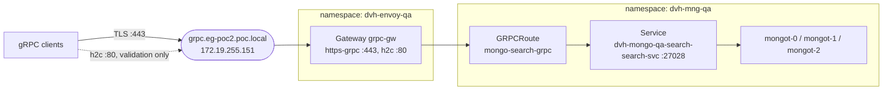
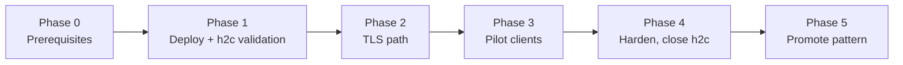

# Proposal: Expose MongoDB Search (mongot) through Envoy Gateway over gRPC

| Field | Value |
|---|---|
| Status | Proposed |
| Author | `<name>` |
| Reviewers | `<platform team>`, `<MongoDB / search owners>`, `<security>` |
| Environment | QA (`dvh-envoy-qa`, `dvh-mng-qa`) |
| Created | 2026-09-22 |
| Reference implementation | [README](../README.md), [manifests](../manifests/) |

## 1. Summary

We propose exposing the MongoDB Search (`mongot`) cluster in `dvh-mng-qa` through a dedicated Envoy Gateway (`grpc-gw` in `dvh-envoy-qa`), using the Kubernetes Gateway API and a `GRPCRoute`.

Clients get one stable endpoint, `grpc.eg-poc2.poc.local` (MetalLB VIP `172.19.255.151`), with TLS on port 443. A temporary h2c listener on port 80 supports validation and is removed before production sign-off. The gateway routes to the shared mongot Service, so Envoy load-balances each request across all three replicas, and replicas can fail or scale without any gateway change.

## 2. Background and problem

- `mongot` runs as a 3-replica StatefulSet managed by the MongoDB Operator. Its Services are reachable only inside the cluster.
- The per-pod Services the operator creates (for example `dvh-mongo-qa-search-search-0-proxy-svc`) each select a single pod. Pointing clients at one of them creates a single point of failure with no load balancing and no scale-out.
- gRPC runs over HTTP/2, which multiplexes many calls on one long-lived connection. L4 load balancing (a plain LoadBalancer Service or kube-proxy) pins each client to one pod, so load spreads poorly.
- Without a gateway there is no standard, TLS-protected entry point with a stable hostname, which makes access inconsistent and troubleshooting harder.

## 3. Goals and non-goals

**Goals**

- A single stable DNS endpoint for gRPC access to mongot.
- TLS on the production path, with certificates managed centrally at the gateway.
- Per-request load balancing across all mongot replicas, with automatic failover.
- Scale mongot replicas without touching gateway configuration.
- All configuration declarative and version-controlled (this repository).
- Clear ownership split: the platform team owns the Gateway (`dvh-envoy-qa`); the search/DB team owns the route (`dvh-mng-qa`).

**Non-goals**

- Changing mongot or MongoDB Operator configuration.
- Exposing `mongod` through this gateway.
- Client authentication and authorization at the gateway (see Open questions).
- Multi-cluster or cross-region routing.
- Production rollout beyond QA; that follows as a separate change once this proposal is accepted.

## 4. Proposed design



```text
  +-------------------------------------------+
  | gRPC clients                              |
  | TLS :443 (production), h2c :80 (testing)  |
  +---------------------+---------------------+
                        | grpc.eg-poc2.poc.local -> 172.19.255.151 (MetalLB)
                        v
  +-------------------------------------------+
  | namespace: dvh-envoy-qa                   |
  | Gateway: grpc-gw                          |
  |   https-grpc :443  TLS terminate          |
  |   h2c        :80   h2c, temporary         |
  +---------------------+---------------------+
                        | GRPCRoute: mongo-search-grpc
                        v
  +-------------------------------------------+
  | namespace: dvh-mng-qa                     |
  | Service: dvh-mongo-qa-search-search-svc   |
  | port 27028, Envoy balances per request    |
  | -> mongot-0, mongot-1, mongot-2           |
  +-------------------------------------------+
```

The full architecture diagrams, request flow and manifests are in the [README](../README.md).

### Components and ownership

| Component | Name | Namespace | Owner |
|---|---|---|---|
| EnvoyProxy | `grpc-gw-proxy` | `dvh-envoy-qa` | Platform |
| Gateway | `grpc-gw` | `dvh-envoy-qa` | Platform |
| TLS secret | `eg-poc2-tls` | `dvh-envoy-qa` | Platform / Security |
| GRPCRoute | `mongo-search-grpc` | `dvh-mng-qa` | Search / DB team |
| Service and StatefulSet | `dvh-mongo-qa-search-search(-svc)` | `dvh-mng-qa` | MongoDB Operator |
| Envoy data plane (Deployment + LoadBalancer Service) | managed | `envoy-gateway-system` | Envoy Gateway |

## 5. Key design decisions

| # | Decision | Choice | Rationale |
|---|---|---|---|
| D1 | Backend target | Shared Service `dvh-mongo-qa-search-search-svc` | Selects all replicas: load balancing, failover and scale-out with no gateway change. Per-pod Services are a single point of failure. |
| D2 | Load-balancing layer | Envoy (L7, per request) | Envoy reads EndpointSlices and balances individual gRPC calls. L4 balancing pins long-lived HTTP/2 connections to one pod. |
| D3 | TLS handling | Terminate at the gateway | Enables hostname and gRPC method routing and central certificate management. Trade-off: the gateway-to-mongot hop is cleartext inside the cluster unless a `BackendTLSPolicy` is added. |
| D4 | Test path | h2c listener on port 80, temporary | Validates routing and endpoints without TLS in the way. Removed, or moved to an internal-only Gateway, before production. |
| D5 | Namespace layout | Gateway in `dvh-envoy-qa`, route in `dvh-mng-qa` | Follows the Gateway API role model. Route and Service share a namespace, so no ReferenceGrant is needed. |
| D6 | Dedicated Gateway and VIP | Separate `grpc-gw` rather than sharing an HTTP gateway | Limits blast radius and lets gRPC settings (timeouts, TLS, policies) evolve independently. |

## 6. Alternatives considered

| Alternative | Why not chosen |
|---|---|
| Route to a per-pod proxy Service | Single point of failure, no load balancing, no scale-out. |
| Expose the mongot Service directly as `type: LoadBalancer` | L4 only: no TLS termination, no hostname routing, and HTTP/2 connections pin clients to one pod. |
| TLS passthrough with `TLSRoute` | Keeps TLS end to end, but Envoy cannot see individual gRPC calls, so balancing is per connection. `TLSRoute` is also in the Gateway API experimental channel. |
| Ingress controller with gRPC annotations | Vendor-specific annotations, weaker role separation and less expressive than Gateway API. |
| NodePort | No stable VIP, no TLS, exposes node ports. |

## 7. Security considerations

- **Certificates.** Issue the gateway certificate from the internal CA (for example with cert-manager) and verify it from clients. Private keys never go into git; `.gitignore` excludes `*.key`, `*.crt` and `*.pem`.
- **Cleartext test path.** The h2c listener on port 80 is unauthenticated cleartext. It exists for QA validation only and is closed before production sign-off (see Rollout, Phase 4).
- **Route attachment.** `allowedRoutes.namespaces.from: All` is restricted to a namespace selector during hardening, so only `dvh-mng-qa` can attach routes.
- **Backend encryption.** If policy requires encryption inside the cluster, add a `BackendTLSPolicy` so Envoy re-encrypts to mongot.
- **Network policy.** Allow ingress to mongot on 27028 only from the Envoy pods and existing `mongod` traffic.
- **Client authentication.** Not in scope for this phase. Envoy Gateway can add client-certificate (mTLS) validation later through a `ClientTrafficPolicy`.

## 8. Operations

- **Health and status.** Gateway `PROGRAMMED`, route `Accepted` / `ResolvedRefs`, and EndpointSlice readiness, using the commands in the README.
- **Observability.** Envoy access logs (response flags, upstream host) and Envoy metrics for request rate, errors and latency per mongot endpoint.
- **Scaling.** mongot replicas change through the MongoDB Operator; Envoy picks up new endpoints automatically.
- **Certificate rotation.** Renewing the secret (for example by cert-manager) is picked up by Envoy without a restart.
- **Operator upgrades.** After each operator upgrade, confirm the Service name, port and selector are unchanged; a change shows up as `ResolvedRefs=False` on the route.
- **Runbook.** Deploy, validation, test and troubleshooting steps are in the README.

## 9. Rollout plan



| Phase | Scope | Exit criteria |
|---|---|---|
| 0. Prerequisites | DNS record for `grpc.eg-poc2.poc.local`; VIP `172.19.255.151` in a MetalLB pool; `dvh-envoy-qa` namespace; certificate issued | DNS resolves, VIP free, secret present |
| 1. Deploy and validate (h2c) | Apply `manifests/`; test on port 80 | Gateway programmed, route accepted on both listeners, 3 ready endpoints, `grpcurl` succeeds on :80 |
| 2. TLS path | Test on port 443 with certificate verification | `grpcurl -cacert` succeeds on :443 |
| 3. Pilot | Point one or two agreed clients at the endpoint for an agreed soak period | No client-visible errors; requests spread across all 3 pods |
| 4. Harden | Remove h2c listener; restrict `allowedRoutes`; 2+ Envoy replicas; PDB; NetworkPolicy; timeouts via `BackendTrafficPolicy` | Security review sign-off |
| 5. Promote | Reuse the pattern for other environments | Separate change per environment |

**Rollback.** The gateway resources are additive and do not modify mongot, so rollback is `kubectl delete -f manifests/` and pointing clients back at their previous access path. The backend is unaffected.

## 10. Acceptance criteria

- [ ] Gateway `grpc-gw` is `PROGRAMMED=True` with address `172.19.255.151`.
- [ ] GRPCRoute is `Accepted=True` and `ResolvedRefs=True` on both listeners.
- [ ] Service `dvh-mongo-qa-search-search-svc` has 3 ready endpoints on 27028.
- [ ] `grpcurl` succeeds through port 80 (h2c) and port 443 (TLS, verified certificate).
- [ ] Envoy stats show requests on all three mongot endpoints.
- [ ] Deleting one mongot pod causes no client-visible failures beyond in-flight requests.
- [ ] h2c listener removed before production sign-off.

## 11. Risks and mitigations

| Risk | Impact | Mitigation |
|---|---|---|
| mongot behaviour when calls for one query land on different replicas (for example how search cursors are continued) | Failed or inconsistent queries | Confirm with MongoDB documentation for our operator and mongot version during Phase 1; if needed, use consistent-hash load balancing in a `BackendTrafficPolicy` |
| MetalLB `loadBalancerClass` mismatch or VIP conflict | No external address | Check the MetalLB class and pool in Phase 0 |
| Cleartext test path left open | Unencrypted access to search | Phase 4 gate; acceptance criterion |
| Single Envoy replica | Gateway outage | 2+ replicas in the EnvoyProxy, spread across nodes |
| Long-running queries hit default timeouts | Failed queries | Tune timeouts in a `BackendTrafficPolicy` |
| Operator upgrade renames or relabels the Service | Route loses its backend | Post-upgrade check; alert on route `ResolvedRefs=False` |

## 12. Open questions

1. Which clients will use this endpoint (`mongod`, applications, tooling)?
2. Does security policy require TLS on the gateway-to-mongot hop?
3. Is client authentication (mTLS or other) required at the gateway?
4. What are the production hostname and certificate issuer?
5. Does our mongot version support per-request load balancing across replicas for our query patterns?
6. Which team owns the `dvh-envoy-qa` Gateway day to day?

## 13. Decision and approvals

| Role | Name | Decision | Date |
|---|---|---|---|
| Platform |  |  |  |
| MongoDB / Search |  |  |  |
| Security |  |  |  |

## Appendix: references

- Reference implementation: [README](../README.md) and [manifests](../manifests/)
- Gateway API GRPCRoute: https://gateway-api.sigs.k8s.io/api-types/grpcroute/
- Envoy Gateway documentation: https://gateway.envoyproxy.io/docs/
- MetalLB documentation: https://metallb.io/
